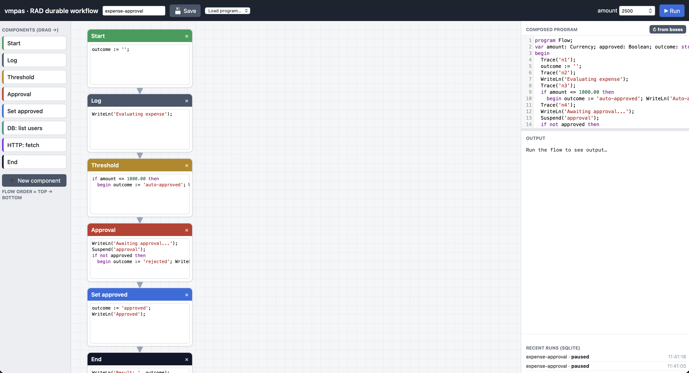

# RAD durable-workflow builder

*A visual, drag‑and‑drop builder for durable workflows, running on the embeddable
[`pkg/vmpas`](../../pkg/vmpas) Pascal engine.*

🇪🇸 *Versión en español: [README.es.md](README.es.md)*



```bash
cd examples/rad && go run .     # then open http://localhost:8080
```

---

## What it is

A small web app where you **compose a workflow by dragging boxes onto a canvas**.
Each box is a snippet of **editable Pascal**; the boxes, top to bottom, become one
Pascal program that runs on the vmpas engine. The point of the demo is to show, in
a tangible way, the features that make vmpas different from a typical embedded
scripting engine:

- **Durable execution.** An **Approval** box calls `Suspend`. The run pauses, its
  full state is serialized and stored, and the UI shows **Approve / Reject**. When
  you choose, the workflow **resumes on a fresh engine** exactly where it left off
  — the way a real service would after a human (or external) decision that might
  arrive seconds or days later.
- **Live execution trace.** Each box reports back as it runs through a bound Go
  callback (`Trace`), so boxes light up ✓ and the paused one pulses ⏸.
- **Go ↔ Pascal binding.** Inputs (`amount`, `approved`) are bound Go variables;
  the result (`outcome`) is read back with `Get`. The backend exposes `Trace`,
  SQL and HTTP to the guest program.
- **Capability sandbox.** Each run executes under a bounded sandbox
  (steps / time limits). This being a local demo, the **Database** and **Network**
  capabilities are granted so the example boxes work (see *Notes* below).
- **Persistence in SQLite.** Saved programs (boxes + positions + code), run
  history and paused states all live in a SQLite database (`rad.db`).
- **Zero‑dependency engine.** vmpas itself pulls in nothing. The SQLite driver
  lives only here, in this example’s **own Go module**, so it never enters the
  engine’s import tree.

## How to use it

1. **Run it:** `cd examples/rad && go run .`, then open `http://localhost:8080`.
2. **Build a flow.** Drag components from the left palette onto the canvas. The
   **flow order is the vertical position** of the boxes (top → bottom); connectors
   are drawn automatically. Drag a box’s header to move/reorder it.
3. **Edit any box.** Every box holds its own editable Pascal (CodeMirror, with a
   Pascal mode). Editing a box only affects **that** box in **that** program —
   never the palette component or other programs.
4. **Create your own component.** Click **➕ New component**, give it a name and
   Pascal code; it joins the palette and is reusable (stored in your browser).
5. **Run it.** Set `amount` and press **▶ Run**. With `amount > 1000` the flow
   reaches the **Approval** box and pauses — click **Approve** or **Reject** to
   resume. With a small amount the **Threshold** box auto‑approves and stops.
6. **Save & reload.** Type a name and **💾 Save** (stored in SQLite). Pick it from
   **Load program…** to bring it back and run it again. Recent runs are listed.
7. **Resize** the program editor by dragging the horizontal splitter beneath it.

## Built‑in components

| Component | What its Pascal does |
|---|---|
| **Start** | initializes `outcome` |
| **Log** | `WriteLn` a message |
| **Threshold** | auto‑approve and `Halt` when `amount` is below a limit |
| **Approval** | `Suspend('approval')`; on reject set `outcome` and `Halt` |
| **Set approved** | set `outcome := 'approved'` |
| **DB: list users** | `Db*` query over the local SQLite (`SELECT … FROM users`) |
| **HTTP: fetch** | `HttpGet` the bundled `/demo/api` + `JsonStr` |
| **End** | `WriteLn` the final `outcome` |
| **Custom Pascal** | (via *New component*) anything you write |

## How it works

```
Browser (drag‑and‑drop, CodeMirror)
   │  composes the boxes into one Pascal program (+ Trace('id') per box)
   ▼  POST /api/run  { program, amount }
Go backend (net/http)
   │  vmpas.NewWith(sandbox) · UseDB(SQLite) · bind amount/approved/Trace
   ▼  RunDurable(program)
embedded vmpas engine
   ├─ runs to completion  → { done, output, outcome, trace }
   └─ hits Suspend        → snapshot persisted in SQLite → { paused, id, trace }
                             Approve/Reject → POST /api/resume → ResumeDurable
```

The frontend composes the program (and injects a `Trace('<box id>')` call before
each box so the backend can report progress); the backend compiles and runs it on
the engine, persisting paused state and run history in SQLite.

### HTTP API

| Endpoint | Purpose |
|---|---|
| `POST /api/run` | `{program, amount, flow}` → run; returns `done` / `paused` (+`id`) / `error`, with `output`, `outcome`, `trace` |
| `POST /api/resume` | `{id, approved}` → resume a paused run |
| `GET/POST /api/flows` | list / save programs (SQLite) |
| `GET /api/flow?name=` | load a saved program |
| `GET /api/runs` | recent run history |
| `GET /demo/api` | a tiny bundled JSON endpoint for the HTTP example |

## What it could become

This is intentionally a compact demo, but the foundation is real. Natural
extensions:

- **Branching & parallelism** — decision nodes with true/false paths, fan‑out/
  join, instead of a linear top‑to‑bottom pipeline.
- **A richer component catalog** — timers/waits, e‑mail/Slack notifications, REST
  calls with auth headers, DB writes, sub‑workflows.
- **Real multi‑approval** — several `Suspend` points, each addressed to a
  different role, with the paused state living in a real database keyed by a
  business id.
- **Versioning & audit** — store program versions; use vmpas’s deterministic mode
  + audit log to replay a workflow run exactly and show who/what touched it.
- **Export** — emit the composed `.pas` to run headless via `cmd/pasrun`, or embed
  the saved program in another Go service.
- **A real engine‑per‑tenant backend** — the same durable/sandbox model behind an
  authenticated API: a lightweight, scriptable workflow service.

Because every workflow is just a vmpas program, anything the language and its
sandbox can do is available to a box — this is a UI over a real, embeddable engine,
not a toy.

## Notes & caveats

- **Local demo only.** To make the example SQL/HTTP boxes work, this server grants
  the `Database` and `Network` capabilities to every run. Don’t expose it as‑is to
  untrusted users; a real deployment would scope capabilities per workflow (see
  [security](../../docs/en/security.md)).
- **CodeMirror loads from a CDN.** Offline, the editors fall back to plain
  textareas (still fully editable).
- **Custom components** persist in the browser (localStorage); **programs** persist
  server‑side in SQLite (`rad.db`, created on first run).
- Runs are **deterministic** (seeded), so a persisted paused state resumes
  reproducibly.

## Files

| File | Role |
|---|---|
| `main.go` | net/http backend: run/resume, SQLite, the `/demo/api` endpoint |
| `index.html` | the whole UI (vanilla JS + CodeMirror), embedded via `//go:embed` |
| `main_test.go` | backend tests (durable run/pause/resume, trace, SQLite) |
| `go.mod` | a **separate module** so the SQLite driver stays out of the engine |
